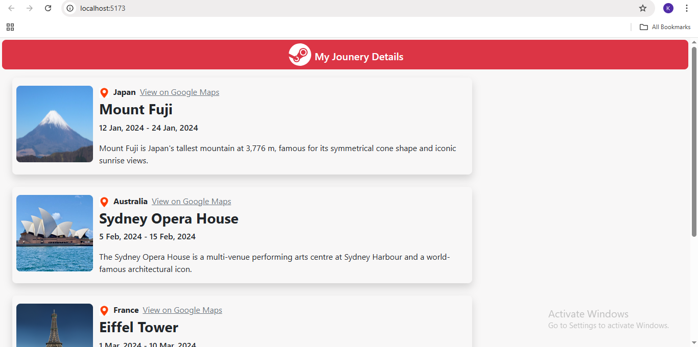

# Learning React – Travel Journey 🌍✨

This is a practice project created to strengthen my understanding of React fundamentals like components, props, and dynamic rendering using the `.map()` function.

## 🧠 What This Project Includes

- A static travel-themed page showing a list of destinations
- Dynamic card rendering using data from a local JavaScript file
- Use of **React props** to pass data into components
- **map()** function used to loop through data and generate components
- Each card displays:
  - 📍 Location
  - 🖼️ Image
  - 📝 Description
  - 🔗 Google Maps link to the place

## 🛠️ Tech Stack

- ⚛️ **React** (set up using **Vite**)
- 🧩 **JavaScript + JSX**
- 🎨 **Bootstrap** for styling
- 🧠 **Props & Components**
- 🔁 **map()** function for rendering lists

## 🎯 Purpose

This project was built as part of my React learning journey.  
It helped me understand:
- How to create and reuse components
- How props and data flow in React
- How to render dynamic UI based on JS data
- How to use Bootstrap for layout and design

## 🔗 Live Demo / GitHub

> 💻 [View the GitHub Repository](https://github.com/Chakradhar-Tech/Learning-React)

## 📷 Preview

